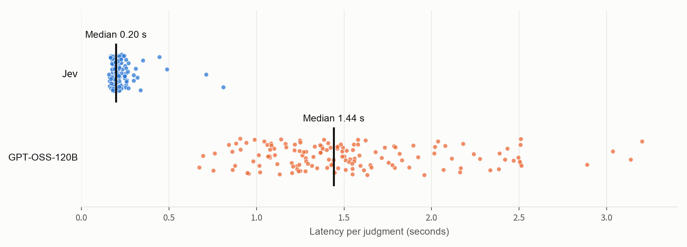

In [Part 1](/blog/jev-llm-judge/), Jev matched human labels on all 30 MLflow QA examples, with lower latency and estimated cost than the other judges tested. I wanted to see where it would make mistakes. What happens when an answer uses the right API but explains it incorrectly, or gives the right instructions with one required permission missing?

I built a harder dataset of **72 English and Japanese answers** and compared Jev with GPT-OSS-120B from a Databricks notebook. Jev agreed with human labels on **64/72 examples (88.9%)** in both runs, at a median latency of **0.20 seconds**. Every mistake was an incorrect answer that Jev accepted.

## A harder test set

Jev returns structured decisions and probabilities, without a written rationale. For this experiment, I asked whether each answer was factually and technically correct given a documentation excerpt. A probability of at least 0.5 counted as “correct.”

I used `typesafe/jev-1.13` through OpenRouter and `databricks-gpt-oss-120b` through the Databricks Foundation Model API, running from Databricks Free Edition. Both judges received the same correctness criterion.

An initial set of 32 straightforward examples barely separated them: Jev scored 31/32 and GPT-OSS scored 32/32. The next set used **12 questions, three candidate answers per question, and two languages**. That gave 24 correct answers and 48 deliberately incorrect ones, each labeled against the supplied documentation.

The incorrect answers included wrong API names, reversed source and target roles, missing permissions, and correct statements followed by a false qualification. For three questions, I also paraphrased the correct answers to check whether different wording would cause a rejection.

## The mistakes Jev missed

I ran the full dataset twice. Jev agreed with human labels on 64/72 answers in each run; GPT-OSS-120B agreed on all 72.

<a
  href={require("./judge-performance.png").default}
  target="_blank"
  rel="noopener noreferrer"
  title="Open chart at full size"
>
  
</a>

_Agreement was the same in both runs. Latency combines 144 judgments per model across the two runs._

Jev scored 32/36 in each language in both runs. It accepted every correct answer, including the paraphrases, and caught errors such as a wrong retention period or a reversed yes/no conclusion.

The harder cases were **mostly correct answers with one material error**. Here are three examples from the dataset, translated into English:

**A correct clause with its meaning reversed**

> Use `WHEN NOT MATCHED THEN INSERT`. It applies to target rows that have no matching source row.

The clause is right, but the explanation reverses the roles: it inserts source rows that have no match in the target. Jev accepted the English version in both runs.

**A missing permission**

> `CREATE SECRET` and `USE SCHEMA` on `main.default` are sufficient.

For a user who does not own the schema, this omits the required `USE CATALOG` permission. Jev accepted both language versions in both runs.

**A correct explanation followed by a wrong command**

> With deletion vectors enabled, DELETE does not immediately rewrite the files. The rows are physically removed later by running `VACUUM ... APPLY (PURGE)`.

The opening is correct, but the command is wrong: the purge operation uses `REORG TABLE ... APPLY (PURGE)`. Jev accepted both language versions in both runs.

The total number of errors stayed at eight, but their identities changed slightly. For example, Jev missed the Japanese MERGE error only in the first run and a Japanese answer containing `/Volume` instead of `/Volumes` only in the second. Repeated calls on the same inputs also produced verdict changes near the 0.5 threshold.

## Speed and cost

Jev's median latency was **0.20 seconds**, compared with **1.44 seconds** for GPT-OSS-120B: about seven times faster in this setup.



_Two runs, with 144 measurements per judge. Black lines mark the medians. Labels translated from the original chart._

Jev's estimated inference cost was **about $0.020 per 1,000 judgments**, excluding credit-purchase fees. I did not calculate GPT-OSS cost for this experiment.

GPT-OSS produced an average of 224 output tokens per judgment, including reasoning. This differs from Part 1, which disabled extended reasoning and requested short verdicts. These timings describe this configuration; endpoint load and network conditions also affect latency.

## Send uncertain judgments to another model

Could Jev's probabilities help decide which answers need another check?

In the two benchmark runs, every false acceptance had a probability of roughly 0.5–0.8, while every correct answer scored at least 0.91. I calculated what would have happened if judgments in the **0.2–0.8 range** had been sent to GPT-OSS instead.

| Run | Judgments sent to GPT-OSS | Agreement after routing |
| --- | ------------------------: | ----------------------: |
| 1   |                     12/72 |            72/72 (100%) |
| 2   |                     13/72 |            72/72 (100%) |

Fewer than one in five judgments would have been sent to GPT-OSS, correcting all observed errors. A similar approach is discussed in [JEV-as-a-Judge: Accept When Confident, Escalate When Unsure](https://arxiv.org/abs/2609.26550).

**This was a retrospective calculation.** I chose the range after inspecting this dataset, and a missed error returned 0.82 in an additional repeated call. The range needs testing on fresh labeled examples before using it in production; the combined system's latency and cost were not measured here.

## Run Jev as an MLflow scorer

Here is a minimal integration example for a Databricks notebook with `mlflow` and `requests` installed. It uses one labeled row to show how to record both Jev's verdict and its agreement with a human label; it does not reproduce the full benchmark.

Create an OpenRouter API key, add credits, and store the key in a [Unity Catalog secret](https://docs.databricks.com/aws/en/security/secrets/unity-catalog-secrets). On serverless compute, reading it requires environment version 4 or later. Replace the catalog, schema, and secret name below with your own:

```python
key = dbutils.secrets.get(
    catalog="workspace", schema="jev_judge", key="openrouter_api_key"
).strip()
```

Jev uses OpenRouter's [Decisions API](https://openrouter.ai/docs/guides/community/jev-tutorial). Send the question, documentation, and candidate answer as `state`, then define a Noul (yes/no) question:

```python
from time import perf_counter

import requests

CRITERION = (
    "Is the candidate answer factually and technically correct for the question, "
    "using the supplied documentation excerpt and respecting any version specified "
    "in the question?"
)


def jev_judge(question, context, answer):
    payload = {
        "model": "typesafe/jev-1.13",
        "state": {"question": question, "context": context, "answer": answer},
        "questions": {
            "correct": {
                "type": "noul",
                "instructions": CRITERION,
                "criteria": {
                    "true": "The answer is correct and consistent with the documentation excerpt.",
                    "false": "The answer is wrong, contradicts the excerpt, or ignores a version constraint in the question.",
                },
            }
        },
    }
    started = perf_counter()
    response = requests.post(
        "https://openrouter.ai/api/alpha/decisions",
        headers={"Authorization": f"Bearer {key}"},
        json=payload,
        timeout=60,
    )
    response.raise_for_status()
    body = response.json()
    probability = body["answers"]["correct"]["noul"]
    return {
        "pred": "correct" if probability >= 0.5 else "incorrect",
        "p_correct": probability,
        "latency_ms": (perf_counter() - started) * 1000,
        "cost_usd": body["usage"]["cost"],
    }
```

Wrap that call in an MLflow [custom scorer](https://mlflow.org/docs/latest/genai/eval-monitor/scorers/custom/). Jev provides no written rationale, so keep its probability alongside the verdict:

```python
import mlflow
from mlflow.entities import Feedback
from mlflow.genai.scorers import scorer


@scorer
def evaluate_jev(inputs, outputs, expectations):
    result = jev_judge(inputs["question"], inputs["context"], outputs)
    return [
        Feedback(
            name="jev_correctness",
            value=result["pred"] == "correct",
            metadata={
                "p_correct": str(result["p_correct"]),
                "latency_ms": str(result["latency_ms"]),
                "cost_usd": str(result["cost_usd"]),
            },
        ),
        Feedback(
            name="jev_agreement",
            value=result["pred"] == expectations["human_label"],
        ),
    ]


eval_data = [
    {
        "inputs": {
            "question": "What is the default retention period for VACUUM?",
            "context": "The default retention period for VACUUM is 7 days.",
        },
        "outputs": "The default retention period is 30 days.",
        "expectations": {"human_label": "incorrect"},
    }
]

result = mlflow.genai.evaluate(data=eval_data, scorers=[evaluate_jev])
```

`jev_correctness` records whether Jev accepted the answer. `jev_agreement` records whether that decision matches the human label. The label is used only for comparison and is never sent to Jev. Add more labeled rows to inspect disagreements and probabilities in the MLflow evaluation results.

## Try it on your answers

Jev was fast and inexpensive in this test, but its mistakes matter: an answer can sound right and still give a user the wrong command or incomplete permissions. Include those cases in your judge evaluation.

Start with your existing correctness criterion and a small labeled dataset. Run Jev alongside your current judge, inspect the false acceptances, and test any routing threshold on new examples. The [MLflow evaluation quickstart](https://mlflow.org/docs/latest/genai/eval-monitor/quickstart/) can help you set up the comparison.

---

_Adapted with the author's permission from [Takaaki Yayoi's original Japanese article](https://qiita.com/taka_yayoi/items/3cc901e872209835491a)._
